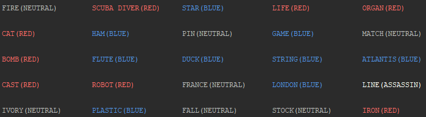
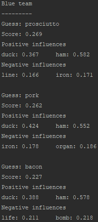
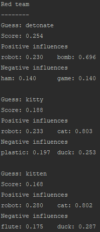
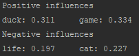

# Codenames

## Description

* In Codenames two teams compete by each having a Spymaster give one word clues which can point to multiple words on the board. 
* The other players on the team attempt to guess their team's words while avoiding the words of the other team.
* In this project we demonstrate that a computer can successfully play the role of a good Spymaster.

## Explanation
* Word2vec is a model that takes a corpus of words and embeds it in a vector space, with similar words having a higher score under the cosine metric.

Note - The user must specify 'target', the number of words the model should aim to link
#### Simple mode
Idea - A clue is only as good as the worst word
1) Loop through all possible guesses  
2) Calculate the cosine similarity between the guess and all your words
3) Set ally score to be the minimum cosine similarity of the top 'target' words
4) Set the enemy score to be the largest cosine similarity between the guess and all the enemy words
5) Set guess score to the ally score minus the enemy score
#### Cluster mode
Idea -  Clues should be clusters of similar words,
rather than just words that link to a guess.
1) Loop through all possible guesses
2) For each cluster of size 'target' of blue words
3) Set ally score to be the sum of pairwise cosine similarities between words in the cluster and the guess (For comparison sake we divide by the size of the cluster here)
4) Set the enemy score to be the largest cosine similarity between the guess and all the enemy words
5) Set guess score to the ally score minus the enemy score
## Usage
Create a Codenames board with:  
`python board.py "codenames_words" -seed 0`  

This gives the following display:

  

To generate guesses we need to supply a list of pre-trained word vectors to word2vec. For this example we download the vectors "crawl-300d-2M.vec.zip" from https://fasttext.cc/docs/en/english-vectors.html and extract them to "crawl.vec".

This looks like a tough board so we will ask for three clues that try to link to two words.
  
Generate predictions on the board with:  
`python prediction.py "codenames_words" "crawl.vec" "common_words" -target 2 -guesses 3 -seed 0 -limit 100000`
  
This gives blue team guesses:  

  

"Pork" looks like a good clue for the blue team.  

The red team guesses are:   

  

"Detonate" looks like a good clue for the red team.
## Advanced usage  
"Cricket" looks like a good clue for the blue team for the above board.  

Let's see what the model thinks:
```
model = load_model("crawl.vec", binary_mode=False, limit=100000)
common_words = [word.strip().lower() for word in open(args.common_words)]  
vocabulary = set(model.vocab).intersection(set(common_words))

board = Board("codenames_words", print_board="False", seed=0)
board, blue, red, _, assassin = board.get_board_and_classes()

blue_predictor = Predictor(board, model, vocabulary, blue, red, assassin, target=2)  
blue_predictor.print_influence("cricket")
```
This gives the output:

  

Not a bad clue! The model manages to identify that we wanted to link 'duck' and 'game'.

## TODO

* Develop interactive web-version of the AI


