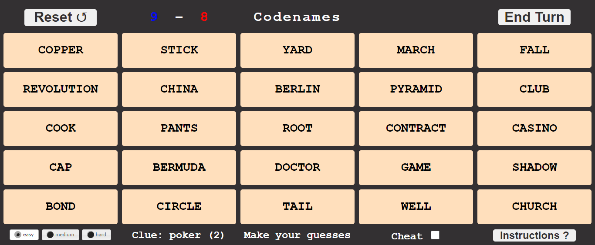

# Codenames

## Description

* In Codenames two teams compete by each having a Spymaster give one word clues which can point to multiple words on the board.
 
* The other players on the team attempt to guess their team's words while avoiding the words of the other team.

* In this project we demonstrate that a computer can successfully play the role of a good Spymaster.

## Usage

The website is no longer open due to hosting costs, but you can still play locally.
```
>>> git clone https://github.com/Pbatch/Codenames.git
>>> cd Codenames
>>> pip install -r requirements.txt
>>> python3 main.py
```

This will launch a webserver at http://127.0.0.1:8080/. 
 
At that address you will be presented with a board like this



A proper explanation is given under "Instructions", 
but the basic idea is that you must find the words 
relating to the clue that the computer has given you.

Here the computer is linking to two words with the clue "Poker (2)".
This clearly refers to "Game" and "Casino" 
so we click those cards and end our turn.


Both our guesses were correct, so the cards went blue
and the score change to 8-7.

After we ended our go, the computer guessed "Revolution" and "Tail".
"Revolution" was correct so went red, 
but "Tail" was neutral so went grey,
and the score changed to 7-7.

Now it's our turn again with the clue "Poland (2)".
If we want to cheat and know what the computer 
is trying to link to we can toggle the cheat box;
in this scenario "China" and "Berlin" light up.


We continue playing in this fashion until a team 
finds all their words or chooses the assassin. 

At the end of the game all of the card's colours will be revealed
and a message will be displayed depending on how you did. 
If we want to play again we can click "Reset"
(changing the difficulty if the first go was too easy).

## Pipeline

#### Cleaning 
First we download the GloVe pretrained word embeddings 
from http://nlp.stanford.edu/data/glove.42B.300d.zip

These are 300 dimensional vectors, 
with the vectors for similar words having high cosine similarity. 

Then we extract words close to the codenames words.
We perform a number of checks to confirm that a word is valid,
with full details being given [here](preprocessing/clean_glove.py).

#### Algorithm
We begin by retrieving the set of relevant guesses for the board,
which is done by taking the union of all the close words of each word on the board.
(This close words were found during the cleaning phase)
 
Now we loop through our guesses and assign a score to each.
First we calculate the cosine similarity between the guess and all the board words,
setting it to 0 if it is below 0.45,
as below 0.45 the scores begin to lose meaning for a human.


Once we have these scores we rescale them so that the sum is 1
and use them as probabilities for a Monte-Carlo simulation.
The idea is that by playing the game multiple times we will get an idea
of the average number of words that the player will be able to guess.
This is what we use as the score of a guess.

Once a score is calculated for each guess,
we take the guess with the maximum score and return it to the user.
Simple :)

## Questions

If you have any questions, queries or concerns I would love to hear from you.  

Please email me at "peter_batchelor1@hotmail.com".


